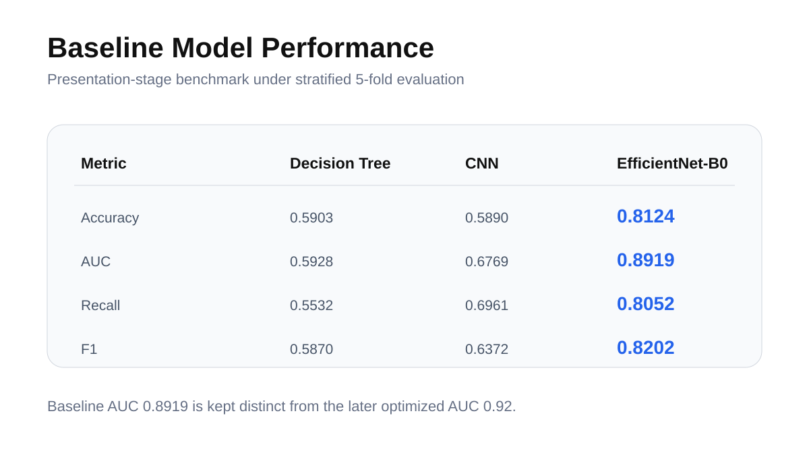
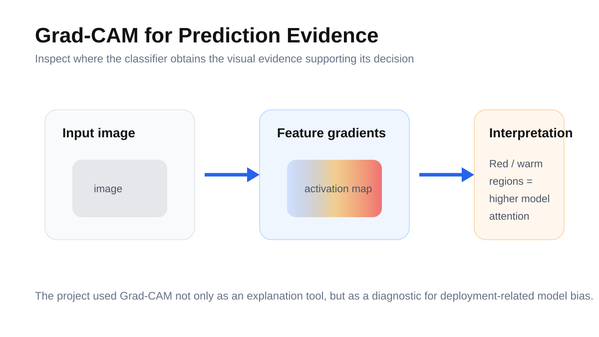
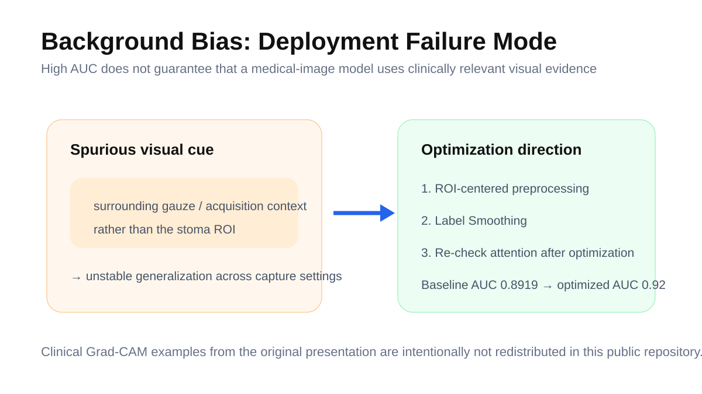

# Deep Learning-Based Stoma Image Classification & Model Optimization

> Classification for remote stoma care, with an emphasis on model generalization and identifying background bias before deployment.

**Period:** Sep. 2025 - Dec. 2025  
**Affiliation:** Machine Learning & Data Mining Laboratory, Ajou University  
**Project:** Industry-Academic Collaborative Research Project  
**Core methods:** EfficientNet-B0 · Grad-CAM · ROI-centered preprocessing · Label Smoothing

---

## Overview

The project developed a deep-learning classifier for smartphone-captured stoma images and then examined **what visual evidence the model was actually using**. The key technical finding was not only the baseline discrimination performance, but the discovery that the model could rely on background context rather than the clinically relevant stoma region.

## Baseline model comparison

The reported presentation-stage EfficientNet-B0 baseline achieved:

| Metric | EfficientNet-B0 |
|---|---:|
| Accuracy | 0.8124 ± 0.0197 |
| AUC | **0.8919 ± 0.0057** |
| Specificity | 0.8206 ± 0.0381 |
| Sensitivity / Recall | 0.8052 ± 0.0184 |
| F1 | 0.8202 ± 0.0172 |

The evaluation used a stratified 5-fold setup in the project presentation.

## Explainability & failure analysis

Grad-CAM was used to inspect which image regions contributed to model predictions. This analysis motivated a specific deployment concern: **background bias** - learning environmental cues that correlate with labels instead of the object of interest.

In the project analysis, the same failure mode was observed in stoma classification: predictions could focus on surrounding gauze / acquisition context instead of the stoma region itself. Because public redistribution of the clinical examples is inappropriate, those pages are not included here.

## Optimization direction

The subsequent portfolio/CV version of the project reports an optimized **AUC of 0.92** after ROI-centered preprocessing and Label Smoothing. This is intentionally distinguished from the **0.8919 presentation-stage baseline** above rather than mixing results from different stages of the project.

## My contribution

The original project presentation reports a 5:5 contribution split between Junha Won and Seunghyun Park. My recorded contributions include:

- Idea exploration
- Data preprocessing
- Methodology design
- Model experiments
- Visualization
- Presentation development and interim presentation

## Project outputs

- [`outputs/classification-public-technical-excerpt.pdf`](outputs/classification-public-technical-excerpt.pdf) - concise public-safe technical excerpt derived from the original project presentation.
- [`outputs/PROJECT_OUTPUTS.md`](outputs/PROJECT_OUTPUTS.md) - source manifest, versioned result notes, and technical provenance.
- The full presentation is not publicly redistributed because it contains clinical images.

## Data & privacy

No original patient-captured stoma images or raw clinical data are included in this repository.

---

**Junha Won** · Ajou University  
[Portfolio](https://juna0926.github.io/Portfolio/) · [GitHub](https://github.com/Juna0926)
